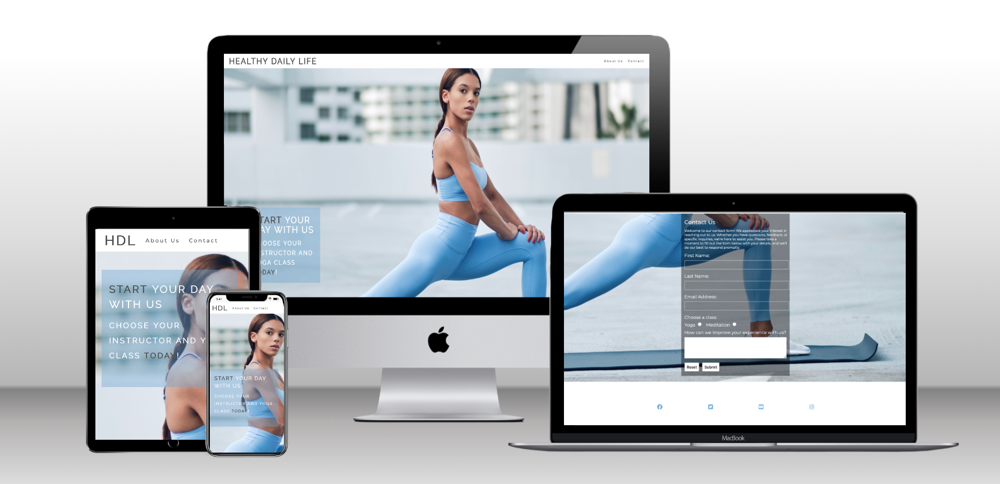

# Healthy Daily Life
  

# Purpose of the project
The purpose of this yoga website is to create an online platform that serves as a holistic wellness hub, offering a variety of yoga classes, informative content, and community engagement. Through a visually inviting interface, the website aims to inspire and guide individuals on their journey to physical, mental, and spiritual well-being. With features such as class information, instructor profiles, engaging multimedia content, and opportunities for community connection, the website seeks to provide a comprehensive resource for both beginners and experienced practitioners, fostering a positive and supportive online yoga community.
 
## User experience
The layout is clean and well-organized, featuring high-quality images of serene yoga environments and practitioners in various poses. The navigation menu is intuitive, providing easy access to key sections such as "About Us and "Contact." 
The website prioritizes user engagement by incorporating a blog that covers topics like mindfulness, wellness, and yoga philosophy. Articles are well-written, accompanied by relevant images, and updated regularly, creating a valuable resource for users interested in deepening their understanding of yoga. 
Responsive design is a priority, ensuring that the website functions seamlessly across various devices, including desktops, tablets, and smartphones. This accessibility enhances the user experience for individuals who may want to access the site on the go. 
In summary, the user experience of this yoga website is characterized by a serene aesthetic, intuitive navigation, informative content, interactive features, and seamless functionality, creating a harmonious online space that mirrors the principles of yoga itself. 
 
# Features

### Navigation
This simple and organized navigation structure ensures that users can easily find the information they need, fostering a positive and user-friendly experience on the yoga website. 
 

### Footer
Social media icons linked to the studio's profiles on platforms like Facebook, Instagram, Twitter, or YouTube are commonly included in the footer. These icons serve as direct links to the studio's social media pages, allowing visitors to connect and engage with the community. The footer section of a yoga website is typically located at the bottom of each page and serves as a navigational and informational area. It often contains essential links. 
 

### Hero-image 
The hero image on a yoga website serves as a prominent and visually captivating element at the top of the homepage. It is the first thing visitors see, and its purpose is to make a strong and positive impression while conveying the essence of the yoga studio. 
The hero image is optimized for responsive design, ensuring that it looks visually appealing and maintains its impact across various devices, including desktops, tablets, and smartphones. In summary, the hero image of a yoga website creates a visually captivating introduction, using a combination of serene scenes, balanced yoga poses, a calming color palette, and clear typography. It sets the tone for the entire site, inviting users to explore the offerings and immerse themselves in the peaceful world of yoga.  Strategically placed on the hero image is a subtle call-to-action, prompting visitors to take the next step, such as exploring classes, joining the community, or signing up for a trial session. This CTA is designed to encourage engagement and guide users deeper into the website.
 

### About Us 
In essence, the "About Us" section is a narrative that humanizes the studio, conveying its values, history, and commitment to the well-being of its community. It aims to create a connection with the audience, making them feel more comfortable and inspired to engage with the studio. 
 

### Video 
In summary, the video section is a multimedia hub that aims to provide a visual and immersive experience for website visitors. By incorporating a variety of video content, the section enhances the overall storytelling and engagement of the yoga studio's online presence. 
 

### Gallery 
The gallery section of a yoga website is a visual showcase that allows visitors to explore and appreciate the aesthetic aspects of the studio. It typically features a collection of high-quality images or photographs capturing various elements related to yoga, the studio space, events, classes, and the overall atmosphere. 
 

### Contact 
The contact section is designed to make it easy for visitors to reach out to the yoga studio through various channels. It provides the necessary contact details, tools for communication, and additional features to enhance the overall user experience.
 

 

# Future features

I want to add javascript to all pages and make the whole site more interactive.
- I want to add a zoom in feature for all pictures
- I want to make a "entry" page with a large design that will take you to the main website when you first load the website
- I want to make the pages move right to left when you go to the next page to the right. And left to right when you go to the previous page.
- Add more videos

 

# Design

- <b>Font</b> : With the help of the Code Institute, Love running project, I got my font from [google fonts](https://fonts.google.com/)

### Colour scheme

 

# Technologies used

- The website is written in HTML and CSS only
- I did all my coding with the program VS Code, [Visual Studio Code](https://code.visualstudio.com/)
- All my code was uploaded to [Github](https://github.com/), to my [Github account](https://github.com/AsliKaradas)]

 

# Testing

Every link on all pages got tested on several devices and webbrowsers. The contact form has been tested as well and works as it should.

### Validation HTML and CSS

The page didn't have any issues :

### Testing on devices and browsers

I tested the deployed wedsite on several devices webbrowsers :
- Iphone 14
- Ipad
- Google pixel 7
- Samsung galaxy tab S6
- HP envy 
- PC build
 
- Google chrome
- Microsoft edge
- Apple Safari

 

# Bug fixes

<b>I have not noticed any existing bugs.</b>

 

# Deployment

The website was deployed to my account on GitHub pages. The steps I took to deploy the website went as followed: 
  - Go to my GitHub repository called Healty Daily (https://github.com/AsliKaradas/healtydaily)
  - In there, I navigated to the Settings tab 
  - From the source section drop-down menu, I selected the Master Branch
  - Once the master branch has been selected, the page will be automatically refreshed with a detailed ribbon display to indicate the successful deployment. 

You can see deployed wedsite (https://aslikaradas.github.io/healtydaily/index.html)

# Credits

- <b>Layout, contact form and code</b> : the navigation and footer layout, the contact form code and some of the basic code I partly got from the Code Institute learning program and projects, [Love Running](https://github.com/Code-Institute-Org/love-running-2.0) and Coding Coffee House
- <b>README</b> : a bit of the layout from the Code Institute Coding club sample, and the [Love Running project](https://github.com/Code-Institute-Solutions/readme-template)
- <b>Images</b> : All images come directly from www.pexels.com

